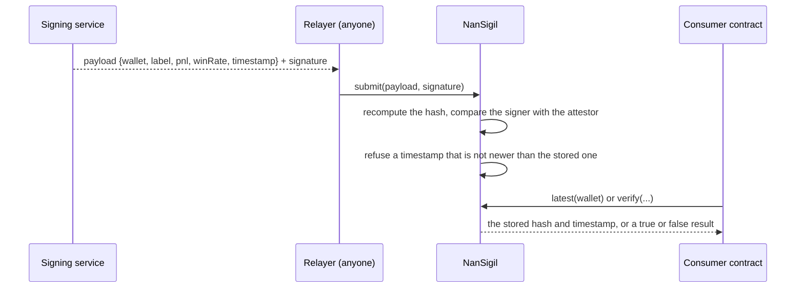

# nansigil-contract

This repository holds the on-chain half of NanSigil. An attestor signs a statement about a wallet off-chain. Anyone can then relay that statement on-chain, and any contract can verify it.

The signing service is in the `custos-attestation` repository.

## What the contract stores

An attestation says four things about one wallet: a label, a realized PnL, a win rate, and the time of the signature. The contract keeps one attestation for each wallet, and it keeps only the newest one.

An attestation belongs to a wallet, not to a product. Each consumer connects it to its own records. Custos, for example, reads `latest(agent.creator)` for the creator wallet of an agent.

## How a payload moves on-chain



The service never sends a transaction. The party that wants the attestation on-chain pays the gas for it.

## Files

| File | Content |
|---|---|
| `src/NanSigil.sol` | The UUPS implementation with `submit`, `verify`, and `latest` |
| `src/interfaces/INanSigil.sol` | The interface that a consumer contract imports |
| `src/NanSigilProxy.sol` | The permanent address of the contract |

## Rules that the contract applies

The signed payload is `keccak256(abi.encode(wallet, label, pnl, winRate, timestamp))` under EIP-191 (`toEthSignedMessageHash`).

1. `submit` recomputes the hash and recovers the signer. If the signer is not the current attestor, the call fails with `AttestationInvalid`.
2. `submit` compares the new timestamp with the stored timestamp. If the new timestamp is not newer, the call fails with `AttestationStale`.
3. `submit` also refuses a timestamp more than 5 minutes in the future. This limit is `MAX_FUTURE`, and it tolerates a clock difference between the attestor and the chain.
4. `submit` emits `AttestationSubmitted` with the full plaintext, so an indexer can serve the inputs for `verify`.
5. Only the upgrade authority can change the attestor or upgrade the contract.

A rotation of the attestor makes every older attestation invalid. `verify` compares the signature with the current attestor, and an old signature no longer matches.

## Trust

NanSigil is verifiable, but it is not trustless. One key signs every attestation, and the operator selects which Nansen labels count. Anyone can prove that a payload is genuine. Nobody can prove that the operator was fair.

## Commands

```bash
forge test
cp .env.example .env
make deploy      # writes the addresses to deployments/anvil.json
make abi         # writes abi/NanSigil.json for clients
make upgrade     # deploys a new implementation and upgrades the proxy
```

CAUTION: SET `ATTESTOR_ADDRESS` TO THE ADDRESS THAT THE SIGNING SERVICE USES. IF THE TWO ADDRESSES ARE DIFFERENT, EVERY RELAYED PAYLOAD FAILS WITH `AttestationInvalid`.
